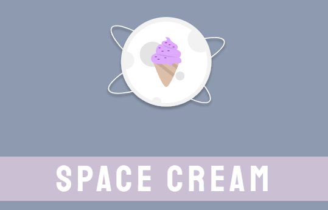
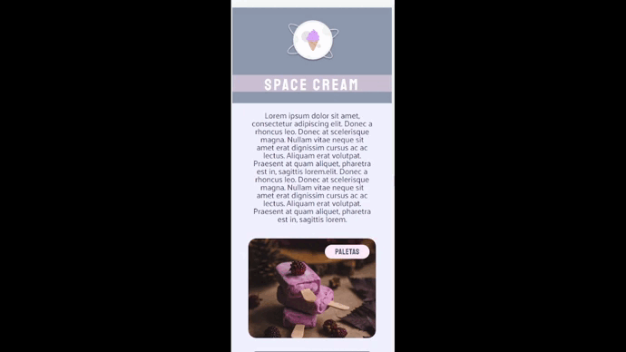
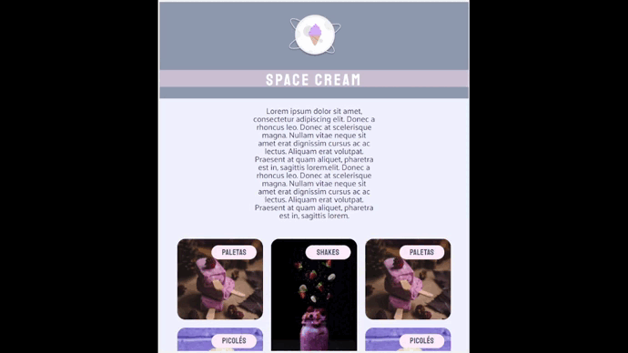
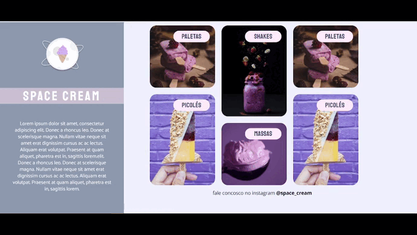

<h1 align="center">
  Space Cream
</h1>

<h2 align="center" >Descrição do Projeto</h2>

  Formulario-de-Avaliação é o 3° e 4° desafio do Nivel 03 do programa Explorer da Rockeseat.
 

 

   

   Desafio tem como principal objetivo realizar a construção de uma landing page de sorveteria totalmente do zero, sendo responsiva em telas Desktop e Mobile, pagina foi construida com protótipo passado pelo Figma, utilizando os conhecimentos adquiridos nas aulas do nível 03.
  

   
   

      
  

  
   
 
 <h2 align="center">
    :iphone: Versão Mobile
 </h2> 
 
  

      
  

   
 <h2 align="center">
    :computer: versão tablets (breakpoint - 700px)
 </h2> 
 
  <h2 align="center">
      
  </h2>
  
   <h2 align="center">
    :computer: Versão Desktop (breakpoint - 1024px)
 </h2> 
 
  <h2 align="center">
      
  </h2>

  
## :rocket: Tecnologias

Esse projeto foi desenvolvido com as seguintes tecnologias e conceitos:

✔️ HTML

✔️ CSS

✔️ Flex-box

✔️ Mobile - First

✔️ Unidades de medidas flexível (REM)

✔️ Variáveis CSS

✔️ Animações (@keyframes)

✔️ Display grid

✔️ Media queries.

